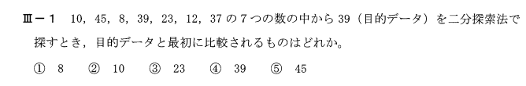

Problem01 - Info Eng - (情報工学部門)
==============================================

解法
====
答えは③

二分探索法についてなので、７つの数は整列済みだとする。
最初に探している数３９が整列済みの配列の真ん中の要素より大きいか小さいかを比較する。

ー＞２３が比較される。

Next Problem
============
:doc:`Info-Eng-02`

Indices and tables
==================

* :ref:`genindex`
* :ref:`modindex`
* :ref:`search`

