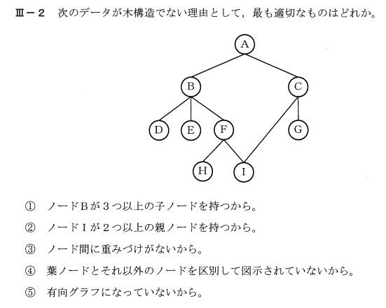

Problem02 - Info Eng - (情報工学部門)
==============================================

解法
====
答えは②

消去法で考えると

* ①ー木構造の要件に子の数の制約はない
* ③ーノード間の重み付けは木構造の要件ではない
* ④ー葉ノードとそれ以外の区別は図に示さなくてもわかる
* ⑤ー有向グラフでない木が基本

Indices and tables
==================

* :ref:`genindex`
* :ref:`modindex`
* :ref:`search`

